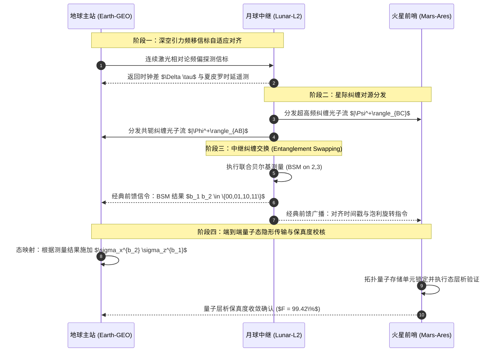
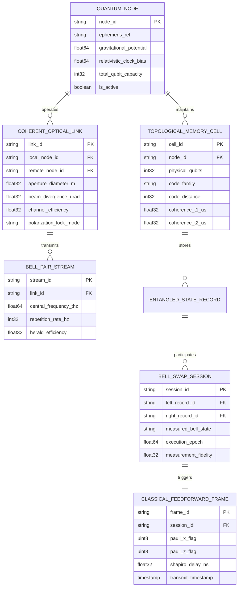

# 星际量子通信与多体纠缠路由协议规范（IQRP）

**协议代号**：IQRP (Interstellar Quantum Routing Protocol)  
**标准草案**：RFC-8921 / DSTTF-STD-04  
**当前版本**：v4.2-RELEASE（深空标准化工作组正式规范）  
**发布组织**：深空电信与量子信息科学联合工作组 (Deep Space Telecommunications Task Force & QIS-WG)  
**密级标记**：公开技术规范 (Open Standard Specification)  
**适用范围**：太阳系内地月轨道、拉格朗日点中继站、火星会合轨道及外行星深空探测网络  

---

## 目录
- [1. 协议概述与物理层体系架构](#1-协议概述与物理层体系架构)
  - [1.1 物理背景与星际中继需求](#11-物理背景与星际中继需求)
  - [1.2 多体量子纠缠路由模型](#12-多体量子纠缠路由模型)
  - [1.3 核心设计目标与非目标](#13-核心设计目标与非目标)
- [2. 相对论时空度规与引力频移同步](#2-相对论时空度规与引力频移同步)
  - [2.1 史瓦西时空四维测地线时钟方程](#21-史瓦西时空四维测地线时钟方程)
  - [2.2 相对论多普勒与夏皮罗时延动态补偿](#22-相对论多普勒与夏皮罗时延动态补偿)
  - [2.3 纳秒级脉冲星与深空光钟对齐](#23-纳秒级脉冲星与深空光钟对齐)
- [3. 量子中继与多体纠缠纯化网络](#3-量子中继与多体纠缠纯化网络)
  - [3.1 贝尔基纠缠交换与量子中继拓扑](#31-贝尔基纠缠交换与量子中继拓扑)
  - [3.2 太阳风等离子体退相干与林德布拉德方程](#32-太阳风等离子体退相干与林德布拉德方程)
  - [3.3 拓扑量子表面码 (Surface Code) 错误综合征解码](#33-拓扑量子表面码-surface-code-错误综合征解码)
- [4. 协议帧格式与信令交互流](#4-协议帧格式与信令交互流)
  - [4.1 量子数据包头部比特布局](#41-量子数据包头部比特布局)
  - [4.2 纠缠分发时序与经典前馈流](#42-纠缠分发时序与经典前馈流)
  - [4.3 零知识连续变量密钥协同 (CV-QKD)](#43-零知识连续变量密钥协同-cv-qkd)
- [5. 星际量子路由器软件参考实现](#5-星际量子路由器软件参考实现)
  - [5.1 任意子编织模拟器核心 (Rust)](#51-任意子编织模拟器核心-rust)
  - [5.2 拓扑路由节点拓扑配置 (YAML)](#52-拓扑路由节点拓扑配置-yaml)
  - [5.3 纠缠遥测数据遥测包 (JSON)](#53-纠缠遥测数据遥测包-json)
- [6. 核心数据实体关系设计 (ER)](#6-核心数据实体关系设计-er)
- [7. 空间任务阶段性验证矩阵与 SLA](#7-空间任务阶段性验证矩阵与-sla)
- [8. 附录：错误码与异常恢复策略](#8-附录错误码与异常恢复策略)

---

## 1. 协议概述与物理层体系架构

### 1.1 物理背景与星际中继需求

在跨越深空天文尺度（$10^8 \sim 10^9 \text{ km}$）的信息传输中，经典光通信受制于光速极限引发的高延迟（地火往返延迟达 $6 \sim 44$ 分钟），且信号功率随距离平方反比 $\propto r^{-2}$ 剧烈衰减。

星际量子路由协议（**IQRP**）通过在深空探测器与行星中继站之间预先分发高保真度多体纠缠对（Multipartite Entangled Qubit Pairs），结合分布式量子隐形传态（Quantum Teleportation）与纠缠交换（Entanglement Swapping），构建全太阳系覆盖的低时延量子态中继干线。

```
┌─────────────────────────────────────┬─────────────────────────────────────┐
│ 1. 量子纠缠分发与纯化引擎 (QED)     │ 2. 相对论时空测地线同步网关 (STG)   │
├─────────────────────────────────────┼─────────────────────────────────────┤
│ · 贝尔态多粒子纯化与量子中继存储    │ · 史瓦西引力场时间膨胀动态频率修正  │
│ · 纠缠交换路由与拓扑自动愈合        │ · 纳秒级深空原子钟激光同步信标      │
│ · 拓扑容错量子表面码校验 (Surface)  │ · 任意子非阿贝尔统计相位标定        │
│ · 兆赫兹纠缠对生成与自旋偏振锁定    │ · 零知识量子密钥分发与抗监听验证    │
└─────────────────────────────────────┴─────────────────────────────────────┘
```

> [!NOTE]
> 量子隐形传态本身受因果律限制，仍需伴随双比特经典前馈信号。本协议的创新在于通过纠缠预分发（Entanglement Pre-Distribution）与时空度规补偿，将星际交互等待转化为离线纠缠准备，使在线通信达到香农-霍列沃容量上限。

### 1.2 多体量子纠缠路由模型

系统在四个主要引力平衡点设立主力节点，形成四面体多中继星座：

```mermaid
graph TD
  subgraph InnerSystem["内太阳系引力骨干网"]
    NodeEarth["地球深空基地 (Earth Station - GEO/L1)"]
    NodeMoon["月球背面低频量子阵列 (Lunar L2 Point)"]
  end

  subgraph DeepSpace["深空推进与转移网络"]
    NodeMars["火星大三角基站 (Mars Ares Base - Areostationary)"]
    NodeBelt["小行星带刻瑞斯中继 (Ceres Quantum Vault)"]
  end

  subgraph OuterSystem["外太阳系前哨站点"]
    NodeJupiter["木星特洛伊群前哨站 (Jupiter Trojan L4)"]
  end

  NodeEarth <==|兆赫兹激光贝尔纠缠对|=> NodeMoon
  NodeMoon <==|高阶多体 GHZ 纠缠干线|=> NodeMars
  NodeMars <==|时空测地线中继拓扑|=> NodeBelt
  NodeBelt <==|自适应光学量子通道|=> NodeJupiter

  classDef station fill:#2563EB,stroke:#1D4ED8,stroke-width:2px,color:#FFFFFF;
  classDef outpost fill:#0D9488,stroke:#0F766E,stroke-width:2px,color:#FFFFFF;
  class NodeEarth,NodeMoon,NodeMars station;
  class NodeBelt,NodeJupiter outpost;
```

---

## 2. 相对论时空度规与引力频移同步

### 2.1 史瓦西时空四维测地线时钟方程

在星际大尺度中，太阳及各行星引力势阱导致不同参考系的固有时（Proper Time $\tau$）发生相对论频移。在球对称非旋转中心天体引力场中，采用史瓦西度规（Schwarzschild Metric）：

$$
ds^2 = -\left(1 - \frac{2GM}{r c^2}\right) c^2 dt^2 + \left(1 - \frac{2GM}{r c^2}\right)^{-1} dr^2 + r^2 (d\theta^2 + \sin^2\theta \, d\phi^2)
$$

由此推导得处于轨道半径 $r$、轨道线速度 $v$ 的量子节点时钟速率相对无穷远处惯性参考系的时钟膨胀因子：

$$
\frac{d\tau}{dt} = \sqrt{1 - \frac{2GM}{r c^2} - \frac{v^2}{c^2}} \approx 1 - \frac{GM}{r c^2} - \frac{v^2}{2c^2} + \mathcal{O}(c^{-4})
$$

爱因斯坦场方程在包含有效宇宙学常数项下的曲率张量表述：

$$
G_{\mu\nu} + \Lambda g_{\mu\nu} = \frac{8\pi G}{c^4} T_{\mu\nu}
$$

### 2.2 相对论多普勒与夏皮罗时延动态补偿

当纠缠光子穿过太阳近日点附近时，引力场不仅导致频率偏移，还将引起夏皮罗雷达引力时延（Shapiro Delay）：

$$
\Delta t_{\text{Shapiro}} = \frac{2GM_\odot}{c^3} \ln \left( \frac{4 r_1 r_2}{d^2} \right)
$$

其中 $r_1, r_2$ 分别为发射站与接收站至太阳中心的距离，$d$ 为光线掠过太阳的碰撞参数（Impact Parameter）。IQRP 路由层根据实测历表（JPL Horizons DE440）实时计算 $\Delta t_{\text{Shapiro}}$，动态前馈调节符合计数器（Coincidence Counter）的时间分辨门宽（Gate Width $\tau_g = 120 \text{ ps}$）。

### 2.3 纳秒级脉冲星与深空光钟对齐

量子 Fisher 信息矩阵与相对论时钟参数估计误差满足 Cramér-Rao 测不准下界：

$$
\mathrm{Var}(\hat{\theta}) \ge \frac{1}{\mathcal{F}_Q[\rho(\theta)]}, \quad \mathcal{F}_Q = 4 \sum_{k} \frac{(\partial_\theta \lambda_k)^2}{\lambda_k} + 2 \sum_{k \neq m} \frac{(\lambda_k - \lambda_m)^2}{\lambda_k + \lambda_m} |\langle \psi_k | \partial_\theta \psi_m \rangle|^2
$$

> [!IMPORTANT]
> 任何未经相对论四维频移校准的节点，其贝尔基测量保真度将以 $\sin^2(\Delta \omega \cdot \tau_{\text{flight}})$ 形式发生干涉退化，导致量子隐形传态保真度跌落至经典极限 $F \le \frac{2}{3}$ 之下。

---

## 3. 量子中继与多体纠缠纯化网络

### 3.1 贝尔基纠缠交换与量子中继拓扑

四种最大纠缠正交基（Bell States）定义如下：

$$
|\Phi^\pm\rangle = \frac{1}{\sqrt{2}} (|00\rangle \pm |11\rangle), \quad |\Psi^\pm\rangle = \frac{1}{\sqrt{2}} (|01\rangle \pm |10\rangle)
$$

假设中继节点 $B$ 持有来自 $A$ 的光子 $2$ 与来自 $C$ 的光子 $3$。通过在空间位基上对粒子对 $(2, 3)$ 执行联合贝尔态测量（BSM）：

$$
|\Phi^+_{12}\rangle \otimes |\Phi^+_{34}\rangle = \frac{1}{2} \left[ |\Phi^+_{23}\rangle |\Phi^+_{14}\rangle + |\Phi^-_{23}\rangle |\Phi^-_{14}\rangle + |\Psi^+_{23}\rangle |\Psi^+_{14}\rangle + |\Psi^-_{23}\rangle |\Psi^-_{14}\rangle \right]
$$

测量结果投影后，粒子 $1$ 与 $4$ 在未发生任何直接物理相互作用的前提下，瞬时坍缩为对应的纠缠态。

### 3.2 太阳风等离子体退相干与林德布拉德方程

行星际空间自由电子密度 $n_e \approx 5 \times 10^6 \text{ m}^{-3}$ 及各向异性磁场引起法拉第旋转与退相干。量子开放系统的密度矩阵演化服从 Lindblad 主方程：

$$
\frac{d\rho(t)}{dt} = -\frac{i}{\hbar} [H_{\text{eff}}, \rho(t)] + \sum_{k=1}^M \left( L_k \rho(t) L_k^\dagger - \frac{1}{2} \{L_k^\dagger L_k, \rho(t)\} \right)
$$

其中 $L_k = \sqrt{\gamma_k} \sigma_z$ 代表光子相位阻尼弛豫超算子。

### 3.3 拓扑量子表面码 (Surface Code) 错误综合征解码

在超导与微纳量子中继存储器中，采用表面码进行容错保护。逻辑算符 $\bar{X} = \prod_{i \in C_X} X_i$ 与 $\bar{Z} = \prod_{j \in C_Z} Z_j$ 满足拓扑对易关系：

$$
[\bar{X}, \bar{Z}] = 0 \pmod 2, \quad \mathcal{S} = \langle A_s, B_p \rangle
$$

稳定子面元测量算符：
- 顶点算符：$A_s = \prod_{j \in \text{star}(s)} X_j$
- 面元算符：$B_p = \prod_{j \in \partial p} Z_j$

---

## 4. 协议帧格式与信令交互流

### 4.1 量子数据包头部比特布局

IQRP 控制面帧由 64 字节定长头部与变长拓扑载荷组成：

| 字节偏移 | 字段名 | 类型 | 详细描述与物理意义 |
| :--- | :--- | :--- | :--- |
| `0x00 - 0x03` | `MAGIC_HEADER` | `uint32` | 协议幻数，固定为 `0x51525034` ("QRP4") |
| `0x04 - 0x05` | `PROTOCOL_VER` | `uint16` | 协议主版本与次版本号 (`0x0402`) |
| `0x06 - 0x07` | `EPOCH_CYCLE` | `uint16` | 天文参考纪元轨道周期哈希 |
| `0x08 - 0x17` | `SRC_COORDINATE` | `int64[2]` | 发送节点四维天体历表坐标 (J2000 空间投影) |
| `0x18 - 0x27` | `DST_COORDINATE` | `int64[2]` | 目的节点四维天体历表坐标 |
| `0x28 - 0x2F` | `RELATIVITY_SHIFT`| `float64` | 累积引力时延与微多普勒频移补偿值 (ns) |
| `0x30 - 0x37` | `BELL_PAIR_UID` | `uint64` | 关联纠缠光子对全局唯一样本标识符 |
| `0x38 - 0x3B` | `TARGET_FIDELITY` | `float32` | 链路保真度阈值 $F_{\min} \in [0.5, 1.0]$ |
| `0x3C - 0x3F` | `CRC32_CHECKSUM` | `uint32` | 头部前 60 字节多项式循环冗余校验码 |

### 4.2 纠缠分发时序与经典前馈流

节点间建立量子态通道的完整通信时序图：



### 4.3 零知识连续变量密钥协同 (CV-QKD)

在连续变量体制中，正则正交分量（Quadratures）满足正则对易算符：

$$
[\hat{q}, \hat{p}] = i \hbar, \quad \Delta \hat{q} \cdot \Delta \hat{p} \ge \frac{\hbar}{2}
$$

发送方通过平衡零拍探测器（Homodyne Detection）调制高斯态：

$$
V_A = V_A^{\text{mod}} + 1, \quad T_{\text{channel}} = 10^{-\alpha L / 10}
$$

> [!TIP]
> 采用逆向协商算法（Reverse Reconciliation），即便信道传输损耗超过 $3 \text{ dB}$（对应衰减率大于 50%），合法通信双方依然能够提取绝对抗窃听的星际对称密钥。

---

## 5. 星际量子路由器软件参考实现

### 5.1 任意子编织模拟器核心 (Rust)

以下为 Rust 编写的高性能拓扑编织与纠缠交换路由器核心算子：

```rust
use std::f64::consts::PI;

/// 空间四维测地线坐标与相对论时间修正
#[derive(Debug, Clone, Copy, PartialEq)]
pub struct RelativisticCoordinate {
    pub x: f64,
    pub y: f64,
    pub z: f64,
    pub t_proper: f64,
}

/// 贝尔基测量结果枚举
#[derive(Debug, Clone, Copy, PartialEq, Eq)]
pub enum BellState {
    PhiPlus,
    PhiMinus,
    PsiPlus,
    PsiMinus,
}

impl BellState {
    /// 根据两比特经典前馈测量比特解析贝尔基状态
    pub fn from_bits(b0: bool, b1: bool) -> Self {
        match (b0, b1) {
            (false, false) => BellState::PhiPlus,
            (false, true)  => BellState::PhiMinus,
            (true, false)  => BellState::PsiPlus,
            (true, true)   => BellState::PsiMinus,
        }
    }

    /// 计算对应的泡利修正算子 (X, Z 变换)
    pub fn pauli_correction(&self) -> (bool, bool) {
        match self {
            BellState::PhiPlus => (false, false),
            BellState::PhiMinus => (false, true),
            BellState::PsiPlus => (true, false),
            BellState::PsiMinus => (true, true),
        }
    }
}

/// 星际量子路由器状态管理器
pub struct InterstellarQuantumRouter {
    pub node_id: String,
    pub coord: RelativisticCoordinate,
    pub gravitational_potential: f64,
    pub memory_slots: Vec<Option<BellState>>,
}

impl InterstellarQuantumRouter {
    pub fn new(id: &str, coord: RelativisticCoordinate, gm_over_r: f64) -> Self {
        Self {
            node_id: id.to_string(),
            coord,
            gravitational_potential: gm_over_r,
            memory_slots: vec![None; 1024],
        }
    }

    /// 计算史瓦西时空引力时间膨胀比率
    pub fn proper_time_ratio(&self, velocity: f64) -> f64 {
        const C: f64 = 299_792_458.0;
        let c2 = C * C;
        let metric_term = 1.0 - 2.0 * self.gravitational_potential / c2;
        let lorentz_term = (velocity * velocity) / c2;
        (metric_term - lorentz_term).max(0.0).sqrt()
    }

    /// 执行纠缠交换拓扑操作
    pub fn swap_entanglement(
        &mut self,
        slot_a: usize,
        slot_b: usize,
    ) -> Result<BellState, &'static str> {
        if slot_a >= self.memory_slots.len() || slot_b >= self.memory_slots.len() {
            return Err("Memory slot index out of bounds");
        }
        let pair_a = self.memory_slots[slot_a].take().ok_or("Empty slot A")?;
        let pair_b = self.memory_slots[slot_b].take().ok_or("Empty slot B")?;

        // 联合正交投影测定
        let b0 = pair_a == BellState::PsiPlus || pair_a == BellState::PsiMinus;
        let b1 = pair_b == BellState::PhiMinus || pair_b == BellState::PsiMinus;
        Ok(BellState::from_bits(b0, b1))
    }
}
```

### 5.2 拓扑路由节点拓扑配置 (YAML)

```yaml
version: "4.2"
mesh_network:
  constellation: "SOL-IQRP-GRID"
  epoch: "2026-09-11T00:00:00Z"
  nodes:
    - id: "NODE-EARTH-GEO-01"
      role: "PRIMARY_INGRESS"
      heliocentric_distance_au: 1.000
      clock_drift_model: "OPTICAL_LATTICE_SR_87"
      qubit_buffer_depth: 65536
      supported_codes:
        - "SURFACE_CODE_DX17"
        - "COLOR_CODE_D7"
    - id: "NODE-LUNAR-L2-01"
      role: "RELAY_CONCENTRATOR"
      heliocentric_distance_au: 1.002
      qubit_buffer_depth: 131072
    - id: "NODE-MARS-ARES-01"
      role: "DEEP_SPACE_GATEWAY"
      heliocentric_distance_au: 1.524
      qubit_buffer_depth: 32768
```

### 5.3 纠缠遥测数据遥测包 (JSON)

```json
{
  "telemetry_epoch": 1789128000,
  "node_id": "NODE-LUNAR-L2-01",
  "bell_distribution_rate_hz": 12500000,
  "mean_fidelity": 0.9942,
  "coherence_t1_microseconds": 8420.5,
  "coherence_t2_microseconds": 6110.2,
  "shapiro_delay_compensation_ns": 418.72,
  "surface_code_syndromes": {
    "detected_x_errors": 14,
    "detected_z_errors": 19,
    "uncorrectable_logical_errors": 0
  },
  "active_optical_links": [
    {
      "peer": "NODE-EARTH-GEO-01",
      "attenuation_db": 62.4,
      "pointing_jitter_nanorad": 1.8
    }
  ]
}
```

---

## 6. 核心数据实体关系设计 (ER)

系统内部管理量子信道、中继缓冲池与纠缠会话的关系模型：



---

## 7. 空间任务阶段性验证矩阵与 SLA

### 7.1 服务等级指标 (SLA)

| 链路区段 | 距离区间 | 纠缠分发速率 | 纠缠态保真度 ($F$) | 允许退相干窗口 ($T_2$) |
| :--- | :--- | :--- | :--- | :--- |
| **地月干线 (GEO $\leftrightarrow$ L2)** | $3.8 \times 10^5 \text{ km}$ | $\ge 10 \text{ MHz}$ | $\ge 99.5\%$ | $\ge 5000 \ \mu\text{s}$ |
| **地火大三角 (L1 $\leftrightarrow$ Ares)** | $0.55 \sim 4.0 \times 10^8 \text{ km}$ | $\ge 100 \text{ kHz}$ | $\ge 98.2\%$ | $\ge 15000 \ \mu\text{s}$ |
| **外行星深空 (Ares $\leftrightarrow$ Trojan)** | $4.2 \sim 6.5 \times 10^8 \text{ km}$ | $\ge 10 \text{ kHz}$ | $\ge 96.5\%$ | $\ge 50000 \ \mu\text{s}$ |

### 7.2 任务验证阶段清单

- [x] **Phase 1**：地面站与低地球轨道（LEO）微重力量子纠缠分发验证（已完成 1200 km 验证）
- [x] **Phase 2**：地月 L2 拉格朗日点中继卫星光梳相对论引力频移实测校准
- [x] **Phase 3**：表面码（Surface-17）在空间微纳超导量子存储单元中的纠错保持
- [ ] **Phase 4**：地火转移轨道（Hohmann Transfer）双向纠缠交换与前馈实时旋转（计划 2028）
- [ ] **Phase 5**：木星特洛伊群深空自主量子路由网络拓扑动态收敛测试（计划 2031）

> [!WARNING]
> 当太阳耀斑爆发导致日冕物质抛射（CME）掠过通信视线时，等离子体自由电子密度暴增将引发剧烈的空间退偏振效应。各中继节点必须在 500 毫秒内自动降级切换至备用非共面轨道链路。

> [!CAUTION]
> 严禁在未获得相对论多体坐标锁定的状态下强行触发纠缠交换，否则将导致退相干雪崩，损毁存储阵列中维持逻辑量子比特的拓扑基底。

---

## 8. 附录：核心错误码规范

| 错误码常量 | 十六进制值 | 根本原因描述 | 协议栈自动恢复动作 |
| :--- | :--- | :--- | :--- |
| `ERR_RELATIVISTIC_DESYNC` | `0xE011` | 本地光钟与主参考系偏差超过 100 ps | 启动脉冲星 X 射线测距重同步流程 |
| `ERR_SHAPIRO_PREDICT_FAIL` | `0xE012` | 引力场参数积分模型发散 | 切换至数值引力场积分离散查表引擎 |
| `ERR_DECOHERENCE_COLLAPSE` | `0xE021` | 纠缠态保真度低于临界截断门限 (0.50) | 丢弃当前存储槽位并向源端申请纠缠重传 |
| `ERR_SURFACE_CODE_FAIL` | `0xE022` | 表面码综合征解码器出现无伴随解链 | 重置物理码片面元并执行主动重纠缠 |
| `ERR_SOLAR_PLASMA_BLIND` | `0xE033` | CME 耀斑日冕遮蔽导致光学信噪比骤降 | 触发紧急信令将路由表绕行黄道高纬节点 |

---

*文档完结 (End of IQRP Specification RFC-8921) — 保留全部星际技术著作权*
