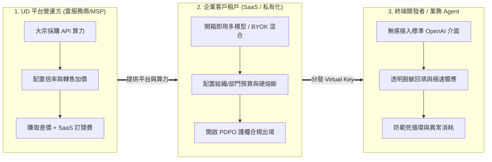
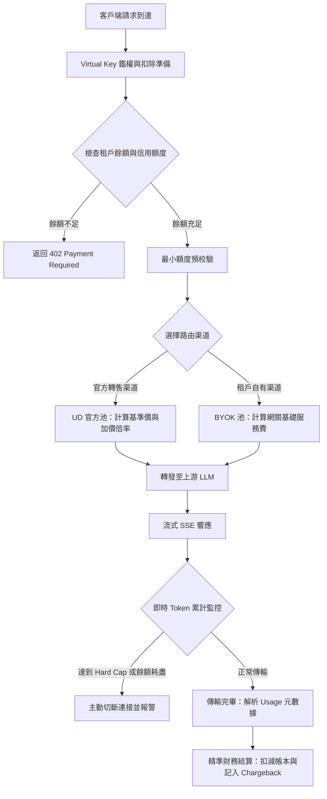
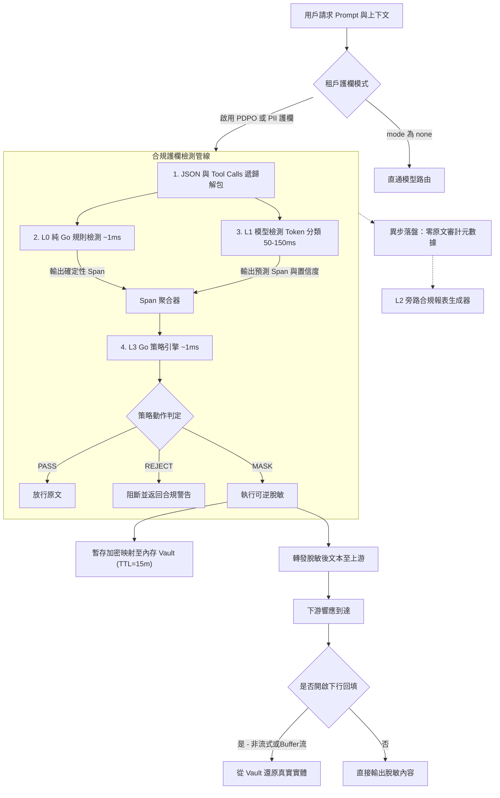
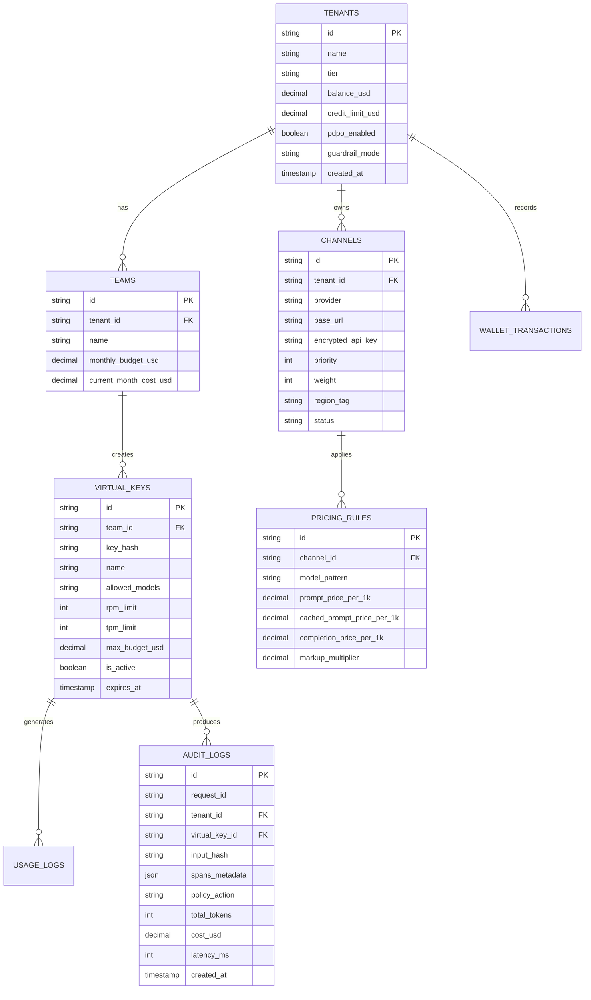

# AI Relay 產品需求文檔（PRD）- 粵語繁體版

**產品版本**：v1.0 正式草案  
**編寫日期**：2026 年 8 月  
**產品定位**：企業級合規 AI 網關與 Token 資產治理作業系統（Enterprise Compliance AI Gateway & Token Governance Platform）  
**目標讀者**：產品經理、架構師、前端/後端/演算法研發工程師、合規專家、UD 營運決策層  

---

## 目錄
- [1. 產品概述與戰略定位](#1-產品概述與戰略定位)
  - [1.1 業務背景與願景](#11-業務背景與願景)
  - [1.2 商業模式與三重角度](#12-商業模式與三重角度)
  - [1.3 核心設計哲學與非目標](#13-核心設計哲學與非目標)
- [2. 組織架構與多租戶權限體系](#2-組織架構與多租戶權限體系)
  - [2.1 四層組織模型](#21-四層組織模型)
  - [2.2 角色與權限控制（RBAC）](#22-角色與權限控制rbac)
  - [2.3 租戶隔離機制](#23-租戶隔離機制)
- [3. 渠道池化與商業計費引擎（FinOps）](#3-渠道池化與商業計費引擎finops)
  - [3.1 雙軌制渠道管理（UD 官方池 vs 租戶 BYOK）](#31-雙軌制渠道管理ud-官方池-vs-租戶-byok)
  - [3.2 動態計費與加價演算法（Pricing Engine）](#32-動態計費與加價演算法pricing-engine)
  - [3.3 帳戶餘額預扣與流式動態熔斷](#33-帳戶餘額預扣與流式動態熔斷)
  - [3.4 BYOK 模式嘅增值服務收費模型](#34-byok-模式嘅增值服務收費模型)
  - [3.5 渠道主動健康探活與上游流控](#35-渠道主動健康探活與上游流控)
- [4. 可插拔安全合規護欄引擎（Pluggable Guardrail Mesh）](#4-可插拔安全合規護欄引擎pluggable-guardrail-mesh)
  - [4.1 插件式護欄架構與路由策略](#41-插件式護欄架構與路由策略)
  - [4.2 香港 PDPO 專屬合規套件（L0 / L1 / L3 / L2）](#42-香港-pdpo-專屬合規套件l0--l1--l3--l2)
  - [4.3 結構化 JSON 與 Agent Tool Calls 深度掃描](#43-結構化-json-與-agent-tool-calls-深度掃描)
  - [4.4 雙向可逆脫敏與臨時內存 Vault](#44-雙向可逆脫敏與臨時內存-vault)
  - [4.5 零原文不可篡改審計追蹤（Zero-Raw-Text Audit）](#45-零原文不可篡改審計追蹤zero-raw-text-audit)
- [5. 智能多模型路由與數據面中繼（Data Plane）](#5-智能多模型路由與數據面中繼data-plane)
  - [5.1 統一 API 協議適配](#51-統一-api-協議適配)
  - [5.2 模型虛擬化與別名體系](#52-模型虛擬化與別名體系)
  - [5.3 合規鎖定路由 vs 故障轉移機制](#53-合規鎖定路由-vs-故障轉移機制)
  - [5.4 客戶端主動中斷與流式準確對帳](#54-客戶端主動中斷與流式準確對帳)
  - [5.5 上游敏感錯誤清洗（Error Sanitization）](#55-上游敏感錯誤清洗error-sanitization)
- [6. Agent 治理與防失控機制](#6-agent-治理與防失控機制)
  - [6.1 Agent 遞歸死循環熔斷器（Runaway Loop Breaker）](#61-agent-遞歸死循環熔斷器runaway-loop-breaker)
  - [6.2 工具級調用權限控制（MCP Tool-level RBAC 預留）](#62-工具級調用權限控制mcp-tool-level-rbac-預留)
- [7. 控制台功能與 UI 規格](#7-控制台功能與-ui-規格)
  - [7.1 UD 平台營運管理台（Super Admin Console）](#71-ud-平台營運管理台super-admin-console)
  - [7.2 企業租戶管理台（Tenant Admin Console）](#72-企業租戶管理台tenant-admin-console)
  - [7.3 團隊與開發者視圖（Developer Portal）](#73-團隊與開發者視圖developer-portal)
- [8. 核心數據模型與系統架構](#8-核心數據模型與系統架構)
  - [8.1 核心數據庫 ER 設計](#81-核心數據庫-er-設計)
  - [8.2 存儲與部署架構（SQLite-First 到 PG/Redis 集群）](#82-存儲與部署架構sqlite-first-到-pgredis-集群)
- [9. 非功能性需求與性能 SLA](#9-非功能性需求與性能-sla)
- [10. 附錄：核心錯誤碼規範](#10-附錄核心錯誤碼規範)

---

## 1. 產品概述與戰略定位

### 1.1 業務背景與願景

#### 1. 行業與市場背景
隨住生成式大語言模型（LLM）同自主智能體（Agent）深度滲透企業實際生產環境，企業喺擁抱 AI 基礎設施嗰陣普遍面臨三大核心痛點：
1. **多模型接入與憑據管理混亂（Shadow AI & Key Proliferation）**：企業內部各部門各自採購、散收收咁 call 多家供應商嘅 API Key，嚴重欠缺統一嘅身份鑑權、角色權限（RBAC）同埋憑據安全託管。
2. **Token 成本失控與 FinOps 歸因缺失**：欠缺精細化嘅 Token 消耗計量、部門成本分攤（Chargeback）、預算硬熔斷機制，特別係 Agent 容易陷入死循環搞到收到天文數字帳單。
3. **合規出境與數據安全壁壘（香港及跨境市場）**：喺香港及大灣區，企業受香港《個人資料（私隱）條例》（PDPO）、私隱專員公署（PCPD）《人工智能（AI）：個人資料保障模範框架》等嚴格法規規管。金融機構、政企與專業服務客戶因為擔心客戶個人資料（例如香港身份證號碼 HKID、住址、銀行戶口等）外流畀境外大模型，搞到 AI 項目落地全面受阻。

#### 2. UD 嘅戰略升級與商業訴求
UD 作為雲端服務與託管基礎設施供應商（Cloud & Hosting MSP），正全力由傳統基礎算力向**企業級 AI 託管服務商（AI MSP）**演進：
- **算力大宗批發與加價分銷（Resale & Margin）**：UD 具備大宗採購 OpenAI、Azure、Anthropic、DeepSeek 等算力嘅議價優勢，急需一個具備多租戶管理、動態加價倍率（Markup Multiplier）同自動化帳單扣費嘅平台，實現算力批發轉售嘅商業變現。
- **SaaS 託管與增值合規服務**：為企業客戶提供高可用、多租戶嘅 AI 智能路由網關，並透過提供可插拔嘅**香港 PDPO 合規安全護欄**作為差異化王牌賣點，按流量收取增值服務費。

#### 3. AI Relay 產品使命
**AI Relay** 係 UD 基於雲原生高性能 **Envoy AI Gateway** 架構由零開始全新自研嘅**企業級合規 AI 網關與 Token 資產治理作業系統**。

佢喺企業應用/Agent 同多雲大模型之間起咗一座兼具「極致性能、商業計費同安全合規」嘅智能中繼站，具備兩大核心雙輪驅動支柱：

```
┌───────────────────────────────────────────────────────────────────────────┐
│                         AI Relay 核心雙輪驅動架構                         │
├─────────────────────────────────────┬─────────────────────────────────────┤
│ 1. Token 資產治理與商業分銷         │ 2. 可插拔合規安全護欄               │
│  · 基於 Envoy AI Gateway 雲原生底座 │  · 基於 Go ext_proc 高性能自研中間件│
│  · 官方渠道加價轉售 + 租戶 BYOK 雙軌│  · 香港 PDPO 專屬合規套件 (L0~L3)   │
│  · 多租戶 / 組織架構 / RBAC 權限    │  · 毫秒級中英文 PII 實體識別 (Span) │
│  · Virtual Key 統一分發與憑據託管   │  · 雙向確定性可逆脫敏與內存 Vault   │
│  · 即時 Token 計量與軟硬預算熔斷    │  · 零原文不可篡改審計追蹤           │
│  · Agent 遞歸死循環速率主動攔截     │  · 合規強約束路由 (禁止違規降級)    │
└─────────────────────────────────────┴─────────────────────────────────────┘
```

### 1.2 商業模式與三重角度



1. **角度一：UD 平台營運方（SaaS Operator / MSP）**
   - **算力分銷與加價**：批量向上游（Azure OpenAI、Anthropic、DeepSeek 等）採購 API Key 注入渠道池，透過加價倍率（Markup Multiplier）向企業轉售，賺取 Token 差價。
   - **SaaS 平台服務費**：提供多租戶網關託管服務，收取席位費或者按網關路由請求量計費。
   - **增值合規服務**：提供香港 PDPO / PII 安全掃描增值模組，按掃描流量計費。
2. **角度二：企業客戶租戶（Enterprise Tenant）**
   - **一站式模型接入**：唔使再逐間對接各大雲端廠商，支持自由組合 UD 官方渠道池與企業自有密鑰（BYOK）。
   - **成本與權限管控**：多級組織架構、部門成本核算（Chargeback）、預算硬熔斷。
   - **免責合規保障**：喺數據離開企業之前完成敏感資料過濾同最小化，全面符合香港私隱專員公署（PCPD）及相關監管要求。
3. **角度三：終端開發者 / 業務 Agent（End-user / Devs）**
   - **零代碼改造**：100% 兼容 OpenAI 官方 SDK 規範，只需改動 `base_url` 同 `api_key`。
   - **體驗零損耗**：雙向透明脫敏回填，確保 LLM 對話上下文連貫性同流式打字機極低首字時延（TTFT）。

### 1.3 核心設計哲學與非目標

#### 核心設計哲學
1. **控制面與數據面徹底解耦**：數據面專注高性能轉發、流式處理同內聯安全檢測；控制面異步處理配置變更、鑑權更新同離線報表。
2. **模型負責描述，規則負責判定**：合規判定由確定性規則引擎執行，機器學習模型淨係負責實體跨度（Span）檢測同置信度輸出。
3. **合規護欄完全可插拔**：PDPO / PII 護欄作為按需啟用嘅中間件，唔會同網關流量轉發強行綁定。
4. **數據最小化與零原文留存**：審計日誌同帳單流水絕不落盤任何用戶 Prompt 原文同模型響應原文。

#### 明確嘅非目標（Non-Goals）
- **唔做法律結論判定**：系統輸出「檢測到 X 類敏感數據並觸發策略 Y」，絕不生成「此行為違反 PDPO」等法律定性結論。
- **唔做絕對匿名化保證**：根據 PCPD《模範框架》，脫敏屬於數據最小化措施，系統唔承諾生成數學意義上嘅完全匿名化數據集。
- **唔侵入修改開源 SDK**：嚴格保持同標準 HTTP / SSE / OpenAI API 協議一致，唔要求客戶端集成專有 SDK。

---

## 2. 組織架構與多租戶權限體系

### 2.1 四層組織模型

```
Platform (UD 平台超管)
  └── Tenant / Organization (企業租戶，例如 ABC 銀行)
        └── Team / Project (部門或者項目組，例如 財富管理部、客服研發組)
              └── Virtual Key / Member (終端虛擬 Key、開發者個人帳戶、業務 Agent)
```

1. **Platform（平台層）**：UD 營運全局視圖，管理全局所有租戶、系統級渠道池、官方模型基準價同全局監控。
2. **Tenant（企業租戶層）**：企業法人實體邊界。擁有獨立嘅帳戶銀包、獨立嘅 BYOK 上游渠道、全局安全策略（PDPO 開關）同發票帳單。
3. **Team（部門/項目組層）**：業務隔離單元。分配租戶級給定嘅資金配額同並發限額，獨立管理本組內部嘅項目憑據。
4. **Virtual Key（虛擬調用憑據）**：系統分發嘅 Bearer Token（形式如 `sk-air-xxxxxx`）。每個 Key 綁定指定嘅模型白名單、速率限制（RPM/TPM）、預算上限及過期時間。

### 2.2 角色與權限控制（RBAC）

系統預設五類標準角色：

| 角色名稱 | 所屬層級 | 核心權限與職責 |
|---|---|---|
| **Super Admin（平台超管）** | Platform | 維護全局上游渠道、調整各模型加價倍率、審核租戶資質、劃撥信用額度、查看全平台財務與性能指標。 |
| **Tenant Owner（企業主管理員）** | Tenant | 為租戶銀包增值、管理企業 SSO/IdP、配置租戶級 BYOK 密鑰、啟閉 PDPO 合規護欄、建立/刪除部門。 |
| **Tenant Compliance Officer（合規官/DPO）** | Tenant | 專門配置脫敏規則、調整 L3 判定策略與實體閾值、匯出合規審計日誌與監管報表（無權查看財務增值）。 |
| **Team Lead（部門負責人）** | Team | 申請部門預算、建立/銷毀業務 Virtual Key、配置 Key 維度嘅模型路由與限流、查看組內 Token 消耗明細。 |
| **Developer / Service Account** | Team | 使用 Virtual Key 接入應用開發，查看自己 Key 嘅調用日誌元數據與即時額度消耗。 |

### 2.3 租戶隔離機制
- **數據面隔離**：租戶配置與 Virtual Key 喺數據面內存中基於哈希表隔離索引，實現 O(1) 複雜度極速鑑權。
- **存儲隔離**：
  - 單機/輕量模式：SQLite 邏輯隔離（`tenant_id` 物理分區索引）。
  - 集群模式：PostgreSQL Row-Level Security (RLS) 或獨立 Schema 隔離。
- **Vault 內存隔離**：各租戶嘅可逆脫敏實體映射表使用租戶專屬衍生密鑰（Derived Key）喺內存中加密暫存，唔同租戶之間物理內存地址完全隔離。

---

## 3. 渠道池化與商業計費引擎（FinOps）



### 3.1 雙軌制渠道管理（UD 官方池 vs 租戶 BYOK）

1. **UD 官方轉售渠道池（Managed Pool）**
   - 由 UD 統一採購主流商業大模型 API Key（Azure OpenAI HK、AWS Bedrock、Anthropic、DeepSeek 官方等）。
   - 渠道支持配置：權重（Weight）、優先級（Priority）、區域標籤（例如 `hk_datacenter`、`us_east`）、並發上限與速率限制（RPM/TPM）。
2. **租戶自有渠道池（BYOK Pool）**
   - 租戶自行上傳其擁有嘅 API Key（例如企業自簽嘅 Azure 協議、私有化部署嘅 vLLM / Ollama 端點）。
   - 密鑰喺數據庫中透過 **AES-256-GCM 強加密**存儲，淨係喺數據面向上游發起請求嗰一刻喺內存中解密。

### 3.2 動態計費與加價演算法（Pricing Engine）

#### 1. 官方轉售渠道計費公式
單次請求嘅計費金額為：
$$\text{Cost} = \left( T_{\text{regular}} \times P_{\text{in}} + T_{\text{cached}} \times P_{\text{cache}} + T_{\text{output}} \times P_{\text{out}} \right) \times M_{\text{tenant}} \times M_{\text{model}}$$

*參數說明*：
- $T_{\text{regular}}$：常規 Prompt 輸入 Token 數；$P_{\text{in}}$：上游輸入基準單價。
- $T_{\text{cached}}$：命中 Prompt Cache 嘅輸入 Token 數；$P_{\text{cache}}$：上游快取命中輸入單價（通常為基準價嘅 10%~20%）。
- $T_{\text{output}}$：模型 Completion 輸出 Token 數；$P_{\text{out}}$：上游輸出基準單價。
- $M_{\text{tenant}}$：針對該租戶嘅特定加價倍率（例如標準租戶 1.25，VIP 租戶 1.10）。
- $M_{\text{model}}$：模型特定調節倍率（可針對稀缺或高成本模型單獨設定加價）。

#### 2. Prompt Caching 精準解析要求
計費引擎必須精確解析各上游供應商返回嘅 Usage 欄位：
- OpenAI / Azure：`usage.prompt_tokens_details.cached_tokens`
- Anthropic：`usage.cache_read_input_tokens` 與 `usage.cache_creation_input_tokens`
- DeepSeek：`usage.prompt_cache_hit_tokens` 與 `usage.prompt_cache_miss_tokens`

### 3.3 帳戶餘額預扣與流式動態熔斷

1. **請求前最小餘額預校驗（Pre-auth Balance Check）**
   - 請求發起嗰陣，系統檢查當前租戶銀包可用餘額 $B_{\text{avail}}$ 是否滿足：
     $$B_{\text{avail}} \ge \min(\text{EstimatedCost}, \text{MinThreshold})$$
     （其中 $\text{EstimatedCost} = (\text{MaxTokens} \times P_{\text{out}} + \text{PromptTokens} \times P_{\text{in}}) \times M$，預設最低門檻 $\text{MinThreshold} = 0.10\text{ USD}$）。
   - 校驗失敗直接返回 HTTP `402 Payment Required`，從源頭徹底防止惡意透支。
2. **流式在途動態熔斷（In-flight Streaming Cutoff）**
   - 喺流式（SSE）傳輸過程入面，數據面代理即時累加輸出 Token（透過分詞器估算或增量計測）。
   - 一旦在途消耗達到該租戶嘅剩餘可用總額（或觸發該 Key 設置嘅 Hard Cap 單次限額），網關**即刻主動斷開下游 SSE 連接**，並向下游客戶端追加發送標準錯誤幀：
     ```json
     {"error": {"message": "Streaming terminated: Tenant quota or budget hard cap exceeded.", "type": "insufficient_quota", "code": "budget_exceeded"}}
     ```
   - 網關同步向上游服務端發起 `Cancel` 取消請求，即時截斷上游計費。

### 3.4 BYOK 模式嘅增值服務收費模型

針對配置自有 API Key 嘅租戶，UD 雖然唔賺取模型差價，但提供以下商業化計費策略：
1. **基礎路由網關費**：按請求次數計費，例如 $0.0005\text{ USD} / \text{Request}$（或包含喺月度 SaaS 席位費中）。
2. **合規安全掃描費（Value-Added Guardrail Surcharge）**：
   - 開啟 PDPO / PII 護欄檢測嗰陣，按掃描字符/Token 規模計費，例如：
     $$\text{Guardrail Fee} = \frac{T_{\text{scanned}}}{1,000,000} \times 0.15\text{ USD}$$

### 3.5 渠道主動健康探活與上游流控

1. **異步主動探活（Active Prober）**
   - 網關後台以可配置週期（預設 30 秒）向各渠道發送輕量探活請求（例如獲取模型列表或 1-token 探測）。
   - 當某渠道連續出現 3 次網絡超時（>3s）或者 5xx 錯誤、401/429 異常嗰陣，系統自動將其標記為 `Degraded` 或 `Offline`，並從活躍路由池剔除，觸發告警。
2. **上游渠道級流控（Upstream Provider Concurrency & TPM Throttling）**
   - 為 UD 採購嘅每個母 Key 配置最大並發連接數與最大 TPM 閾值。
   - 當多個租戶嘅高並發請求瞬間匯聚到同一個母 Key 嗰陣，網關喺內部令牌桶中排隊排期，避免直接將上游母 Key 打爆觸發官方 429 限流。

---

## 4. 可插拔安全合規護欄引擎（Pluggable Guardrail Mesh）



### 4.1 插件式護欄架構與路由策略

每個路由策略或 Virtual Key 可以獨立配置安全護欄模式：

```yaml
guardrail_policy:
  mode: "pdpo_hongkong"           # 可選: none | basic_pii | pdpo_hongkong | custom_dsl
  action_on_match: "mask"         # 可選: mask (脫敏) | reject (阻斷) | pass (僅審計標記)
  reversible: true                # 是否啟用下行可逆回填
  confidence_thresholds:
    PERSON: 0.80
    ADDRESS: 0.75
    FINANCIAL: 0.85
  combination_rules:
    - if: "has(HKID) and has(PERSON)"
      then: "reject"
      reason: "身分證與姓名共現，構成直接識別風險"
```

### 4.2 香港 PDPO 專屬合規套件（L0 / L1 / L3 / L2）

#### 1. L0 規則檢測層（純 Go，確定性，~1ms）
針對格式嚴密、帶校驗位嘅結構化個人資料進行微秒級識別：

| 實體標籤 | 格式規範與校驗演算法 | 確定性置信度 |
|---|---|---|
| `HKID` | 1-2 位字母 + 6 位數字 + 括號校驗位（實施加權模 11 演算法） | 1.00 (`deterministic=true`) |
| `PHONE_HK` | 8 位數字，首位限定為 2/3/5/6/9（香港本地號段表） | 0.98 |
| `CREDIT_CARD` | 13-19 位數字，通過 Luhn 模 10 演算法 + BIN 前綴校驗 | 1.00 (`deterministic=true`) |
| `BANK_ACC_HK` | 3 位銀行代碼 - 3 位分行 - 6~9 位帳號 | 0.95 |
| `BR_NUMBER` | 香港商業登記號（8 位主號 + 3 位分支機構代碼） | 0.95 |
| `PRC_ID` | 中國內地 18 位身份證（GB11643 校驗碼 + 行政區劃 + 出生日期） | 1.00 (`deterministic=true`) |
| `EMAIL` / `IP` | RFC 規範電郵 / IPv4 & IPv6 地址（排除私有保留網段） | 0.99 |

*上下文增強規則*：當喺文本中「身分證」、「香港身份證」、「HKID」、「ID Card」關鍵詞前後 20 個字符範圍內出現類身份證數字串嗰陣，即使缺省校驗位亦會觸發低置信度匹配，交由 L3 策略裁決。

#### 2. L1 模型檢測層（Token Classification，50~150ms）
基於微調嘅中文/多語言 Encoder（例如 `chinese-roberta-wwm-ext`），採用 **BIOES 序列標註規範**，輸出字符偏移跨度（`[]rune`）與校準置信度：
- `PERSON`：中文姓名（繁簡）、粵拼羅馬化姓名（Chan Tai Man）、中英文混合姓名（Michael Chan）。
- `ADDRESS`：香港特色地址層級結構（大廈/屋苑/座數/樓層/室號，例如「沙田第一城12座8樓802室」）。
- `HEALTH` / `FINANCIAL`：非結構化健康病歷描述、非帳號類財務表述（例如「月入八萬、欠債五十萬」）。
- `EMPLOYMENT`：職位與公司共現組合（嚴格遵循標註規範：單獨公司名唔標，同人名共現構成身份指向嗰陣先標註）。

#### 3. L3 策略決策層（純 Go，~1ms）
- 將 L0 與 L1 嘅 Span 列表進行重疊消除與合併（L0 確定性規則優先級高於 L1 模型）。
- 根據租戶配置嘅閾值矩陣與布爾邏輯組合執行最終動作：`PASS`、`MASK`、`REJECT`、`ESCALATE`。

#### 4. L2 解釋與報表層（旁路 LLM，1~5s，移出主路徑）
- **絕不串聯喺即時請求主路徑上**。
- 淨係用於事後異步報表生成，根據 L0/L1/L3 審計日誌，批量生成符合 PCPD《模範框架》要求嘅合規自評報告與風險摘要。
- **硬性約束**：嚴禁由 LLM 自主編造或者推理 PDPO 條款編號。

### 4.3 結構化 JSON 與 Agent Tool Calls 深度掃描

現代 Agent 請求中，敏感數據唔單止出現在純文本 `prompt` / `messages.content` 中，仲大量分佈喺 JSON 結構體入面。
AI Relay 護欄引擎內置**遞歸 JSON 掃描解析器**：
- 自動解包掃描 `messages[].content`（支持多模態 Content 數組中嘅文本項）。
- 自動解包掃描 `tools` 與 `tool_calls` 中嘅 `function.arguments`（解析內嵌 JSON 字符串）。
- 脫敏替換嗰陣保持 JSON 語法嘅嚴格合法性，避免破壞上游模型嘅 JSON 解碼。

### 4.4 雙向可逆脫敏與臨時內存 Vault

```
[原始輸入]   "客戶 陳大文 (身分證 A123456(3)) 申請貸款。"
     │
     ▼ (網關上行脫敏)
[脫敏後輸入] "客戶 [PERSON_1] (身分證 [HKID_1]) 申請貸款。"  ──► 發往外部 LLM
     │
     ├── 暫存至內存 Vault: { "[PERSON_1]": "陳大文", "[HKID_1]": "A123456(3)" } (TTL: 15分鐘)
     │
     ▼ (LLM 生成回覆)
[LLM 回覆]  "已為 [PERSON_1] 建立貸款申請檔案，身分證確認為 [HKID_1]。"
     │
     ▼ (網關下行還原)
[最終返回]   "已為 陳大文 建立貸款申請檔案，身分證確認為 A123456(3)。"
```

#### 關鍵技術實現規範：
1. **單會話確定性佔位符（Deterministic Session Placeholders）**：
   - 佔位符採用 `[PERSON_1]`、`[PERSON_2]` 序號遞增形式，**嚴禁使用隨機 UUID**。
   - 保證相同實體喺同一會話中嘅佔位符哈希一致，**最大化保留上游大模型嘅 Prompt Caching 命中率**。
2. **Vault 臨時內存存儲與 TTL 銷毀機制**：
   - 映射關係淨係暫存於 Go 數據面內嵌嘅高速 Cache（或獨立 Redis），**強制設置 TTL（預設 15 分鐘）**。
   - 會話結束或超時後**物理內存即刻擦除，絕不持久化落盤到數據庫**，徹底杜絕 AI Relay 變成新敏感資料庫嘅合規風險（完全符合 DPP2/DPP4 規定）。
3. **流式 SSE 場景下嘅回填策略**：
   - **預設推薦策略**：喺流式 SSE 模式下，網關上行執行脫敏，下行流式保持佔位符直接推送（保障打字機首字時延 TTFT 零開銷）；客戶端前端/SDK 喺渲染完成後統一執行映射回填。
   - **網關內滑動窗口回填（可選配置）**：數據面維護深度為 32 字符嘅 Ring Buffer，處理跨 Chunk 佔位符重組後流式輸出。

### 4.5 零原文不可篡改審計追蹤（Zero-Raw-Text Audit）

每次請求喺數據面完成處理後，異步生成結構化審計事件並寫入唯讀日誌：

```json
{
  "audit_id": "aud_01J5X9827B91",
  "request_id": "req_88a3f9c2",
  "timestamp": "2026-08-14T20:45:00.128Z",
  "tenant_id": "tenant_abc_bank",
  "team_id": "team_wealth_mgnt",
  "virtual_key_id": "key_prod_01",
  "input_hash": "sha256:e3b0c44298fc1c149afbf4c8996fb92427ae41e4649b934ca495991b7852b855",
  "spans_detected": [
    {
      "label": "HKID",
      "start": 10,
      "end": 20,
      "confidence": 1.0,
      "source": "rule",
      "deterministic": true,
      "rule_id": "HKID_CHECKDIGIT_V1"
    },
    {
      "label": "PERSON",
      "start": 3,
      "end": 6,
      "confidence": 0.96,
      "source": "model"
    }
  ],
  "policy_action": "MASK",
  "triggered_rules": ["MASK_PII_RULE_V2"],
  "model_routed": "azure-openai-hk-gpt4o",
  "tokens": {
    "prompt_tokens": 128,
    "cached_tokens": 64,
    "completion_tokens": 256,
    "total_tokens": 384
  },
  "cost_usd": 0.00284,
  "latency_breakdown_ms": {
    "l0_rules": 1,
    "l1_model": 62,
    "l3_policy": 1,
    "upstream_llm": 1240,
    "total": 1304
  }
}
```
*安全合規要求*：審計日誌中**嚴禁包含 Prompt 和 Response 原文文本**，淨係留存 Hash、Span 坐標與扣費元數據。

---

## 5. 智能多模型路由與數據面中繼（Data Plane）

### 5.1 統一 API 協議適配
- **入口端點**：
  - `/v1/chat/completions`（標準 OpenAI 格式，含 SSE 流式）
  - `/v1/models`（模型列表與別名查詢）
  - `/v1/embeddings`（向量嵌入介面）
- **上游轉換支持**：網關喺內存中透明完成 OpenAI 格式與 Anthropic Messages API、Google Gemini 原生 API、以及各類開源 vLLM 端點之間嘅雙向格式轉碼。

### 5.2 模型虛擬化與別名體系
- 租戶唔使理會後端具體嘅物理模型名稱，透過統一別名調用：
  - `auto-fast` → 智能路由至 DeepSeek-V3 或 GPT-4o-Mini
  - `auto-smart` → 智能路由至 GPT-4o 或 Claude-3.5-Sonnet
  - `auto-code` → 智能路由至 Claude-3.7-Sonnet-Thinking
- 管理員可以喺後台動態切換別名映射嘅物理渠道，業務端完全零感知。

### 5.3 合規鎖定路由 vs 故障轉移機制

系統建立嚴格嘅**合規優先分級路由機制（Compliance-First Routing）**：

```
                    ┌─────────────────────────────────────────┐
                    │            路由分流決策引擎             │
                    └────────────────────┬────────────────────┘
                                         │
                   ┌─────────────────────┴─────────────────────┐
                   ▼                                           ▼
      [常規流量 (Normal Tier)]                         [合規鎖定流量 (Compliance Tier)]
     （未觸發敏感數據或僅執行脫敏）                   （檢測到本地敏感數據 / 指定數據駐留）
                   │                                           │
       ┌───────────┴───────────┐                   ┌───────────┴────────────┐
       ▼                       ▼                   ▼                        ▼
   首選: Azure HK       備用: OpenAI US      首選: 香港本地模型     備用: 本地備用節點
       │                       │                   │                        │
       └── (允許 Fallback) ──┘                     └── (禁止跨區Fallback) ──┘
                                                            若全死 ──► Fail-Closed 報錯
```

- **合規鎖定強約束**：凡係標記為需要「數據駐留（Data Residency）」或者觸發特定敏感級別嘅請求，**嚴格禁止向海外或者未經合規認證嘅公有雲節點 Fallback**。
- **Fail-Closed 預設安全原則**：如果合規指定嘅本地計算節點全部不可用，系統直接返回 `503 Compliance Endpoint Unavailable`，寧願中斷服務都絕不靜默違規降級。

### 5.4 客戶端主動中斷與流式準確對帳
- 當客戶端 Web / IDE 觸發中斷（發送 HTTP RST / TCP FIN）嗰陣，數據面監聽到連接取消事件（`ctx.Done()`）。
- 數據面即刻終止向上游嘅讀取，並主動關閉與上游嘅連接；
- 計費系統以**實際上游已交付傳輸嘅 Chunk Token 數**進行結算入帳，杜絕漏計與過度計費爭議。

### 5.5 上游敏感錯誤清洗（Error Sanitization）
- 針對上游返回嘅 4xx/5xx 錯誤響應（例如包含了真實母 Key 片段、上游內部 IP 或集群拓撲嘅 Error Message），網關喺返回下游前統一進行敏感特徵剝離與重寫，替換為統一嘅錯誤體：
  ```json
  {"error": {"message": "Upstream AI provider error. Request ID: req_88a3f9c2", "type": "upstream_error", "code": 502}}
  ```

---

## 6. Agent 治理與防失控機制

### 6.1 Agent 遞歸死循環熔斷器（Runaway Loop Breaker）

自主 Agent 喺處理複雜任務嗰陣可能陷入死循環（Loop Runaway），喺短時間內發起幾百次遞歸調用並消耗巨額費用。
AI Relay 喺網關層內置行為監控器：
1. **會話調用深度監控（Recursion Depth Counter）**：基於 `session_id` 或鏈路追蹤 Header 統計單次會話連續觸發嘅工具調用輪數（預設最大閾值：30 輪）。
2. **異常 Token 消耗速率熔斷（Burst Velocity Limiter）**：如果單個 Virtual Key 喺 60 秒內消耗 Token 超過預設突增上限（例如 200,000 Tokens/min），系統即刻暫停該 Key 嘅調用並向管理員發送告警。

### 6.2 工具級調用權限控制（MCP Tool-level RBAC 預留）
針對模型上下文協議（MCP）流量，網關數據面預留 JSON-RPC 攔截點：
- 支持針對虛擬 Key 配置工具級權限白名單（例如：`允許調用 github_read_issue，嚴禁調用 github_push_code 或 aws_terminate_instance`）。

---

## 7. 控制台功能與 UI 規格

系統提供三套獨立工作台介面：

### 7.1 UD 平台營運管理台（Super Admin Console）
- **渠道池調度看板**：上游供應商 Key 配置、權重調整、健康度狀態儀表板、上游並發/TPM 即時監控。
- **全局定價與加價引擎**：配置全局模型基準價格表、租戶級加價乘數、Prompt Caching 折扣比例。
- **租戶管理與信用財務**：租戶開通/封禁、預先增值銀包管理、信用額度下發、跨租戶收入分帳報表。
- **全平台性能洞察**：P50/P90/P99 時延監控、QPS / Token 流量熱力圖、錯誤率分析。

### 7.2 企業租戶管理台（Tenant Admin Console）
- **組織架構與成員管理**：部門建立、成員邀請、基於 OIDC / 企業微信 / 飛書 / Slack 嘅 SSO 對接、RBAC 角色分配。
- **多維度 FinOps 成本中心**：
  - 按部門（Team）、按項目、按 Virtual Key 嘅 Token 消耗與費用透視報表。
  - 預算硬/軟上限配置、告警 Webhook（支持企業微信、飛書、Slack、釘釘、電郵）。
- **自帶渠道（BYOK）管理**：租戶自有 API Key 嘅錄入、加密託管與連通性測試。
- **PDPO 與安全護欄配置中心**：
  - 護欄模式全局總開關（香港 PDPO / 通用 PII / 關閉）。
  - 實體置信度閾值滑動條、自定義組合阻斷規則 DSL 編輯器。
  - **零原文合規審計日誌檢索器**（支持按時間、Span 類別、動作篩選，支持合規審計報告一鍵匯出）。

### 7.3 團隊與開發者視圖（Developer Portal）
- **Virtual Key 自助管理**：申請新 Key、複製 Key、配置 Key 維度嘅模型權限與額度限制。
- **在線 API 調試工作台（Playground）**：內置類似 OpenAI Playground 嘅測試介面，支持即時驗證模型輸出與脫敏效果。
- **個人/項目用量看板**：即時查看本 Key 嘅今日調用量、Token 消耗曲線與剩餘可用配額。

---

## 8. 核心數據模型與系統架構

### 8.1 核心數據庫 ER 設計



### 8.2 存儲與部署架構（SQLite-First 到 PG/Redis 集群）

系統支持平滑演進嘅雙模存儲架構：

```
┌───────────────────────────────────────────────────────────────────────────┐
│                        單機極簡版 (POC / 單客戶私有化)                    │
├───────────────────────────────────────────────────────────────────────────┤
│  · 單一 Go 二進制執行檔（內嵌 Web 控制台靜態資源 + L0 規則 + L1 ONNX）    │
│  · 內置 SQLite 數據庫（單文件零維運依賴）                                 │
│  · 內存級 Ring Buffer 處理流式脫敏與 Vault 臨時映射                       │
└───────────────────────────────────────────────────────────────────────────┘
                                    │
                                    ▼ (無縫平滑遷移配置)
┌─────────────────────────────────────────────────────────────────────────┐
│                   多租戶高可用集群版 (UD 官方 SaaS 生產環境)            │
├─────────────────────────────────────────────────────────────────────────┤
│  · 數據面（Go Stateless Proxy）多實例水平擴展，K8S Ingress 負載均衡     │
│  · 控制面（Go Admin API + Vue3 Console）獨立容器部署                    │
│  · 持久化存儲層：PostgreSQL 16+（讀寫分離 / RLS 多租戶數據隔離）        │
│  · 狀態與快取層：Redis 7.x Cluster（全局分佈式限流、Vault 會話加密暫存）│
│  · 審計事件流：異步 Kafka / NATS 投遞至唯讀 ClickHouse / OpenSearch     │
└─────────────────────────────────────────────────────────────────────────┘
```

---

## 9. 非功能性需求與性能 SLA

### 9.1 性能與時延預算（Latency SLA）
*喺輸入 1,000 字、並發 100 QPS 條件下嘅數據面附加時延預算*：

| 處理環節 | 目標時延 (P50) | 目標時延 (P95) | 實現方式與技術保障 |
|---|---|---|---|
| **Virtual Key 鑑權與限流** | < 0.5 ms | < 1 ms | 內存哈希索引 / 本地令牌桶 |
| **L0 規則檢測引擎** | < 1 ms | < 2 ms | 純 Go 確定性正規表達式 + 模 11 演算法 |
| **L1 模型檢測引擎** | 40 ms | 120 ms | ONNX Runtime Go 綁定 / CPU 優化推理 |
| **L3 策略決策與脫敏** | < 0.5 ms | < 1 ms | 純 Go 規則矩陣 |
| **網關自身開銷總和** | **< 45 ms** | **< 130 ms** | 唔計上游 LLM 生成網絡耗時 |

### 9.2 字符編碼一致性（Unicode Rune Offset）
- 全鏈路（Go 數據面、L1 ONNX 模型輸出、脫敏回填引擎）**強制統一使用 Unicode Code Point 偏移（Go `[]rune`）**。
- 嚴禁使用 UTF-8 字節偏移混用，徹底杜絕多字節繁體中文字符截斷導致嘅 Span 邊界錯位亂碼 Bug。

### 9.3 容災與高可用性（SRE & Availability）
- **SaaS 平台可用性 SLA**：99.95%。
- **故障隔離原則**：
  - 數據庫短時間不可用嗰陣唔阻斷數據面（數據面內置 60 秒本地憑據與規則 Cache）。
  - 合規服務故障嗰陣嚴格遵循 **Fail-Closed 預設安全原則**。

### 9.4 安全與合規性（Security & Privacy）
- **傳輸加密**：全鏈路強制 TLS 1.3，支持 mTLS 證書雙向認證。
- **存儲加密**：上游 API 憑證及 Vault 映射表全量採用 **AES-256-GCM** 強加密。
- **零日誌留存（Zero Retention）**：生產日誌過濾器嚴禁打印任何請求及響應 Payload。
- **合規標準符合度**：架構設計全面符合香港《個人資料（私隱）條例》（PDPO）、私隱專員公署（PCPD）《人工智能（AI）：個人資料保障模範框架》以及 ISO/IEC 42001 AI 管理體系標準要求。

---

## 10. 附錄：核心錯誤碼規範

| HTTP 狀態碼 | 業務錯誤代碼 (Code) | 含義說明 | 客戶端建議處理方式 |
|---|---|---|---|
| `401` | `invalid_virtual_key` | Virtual Key 唔存在、已被停用或已過期 | 檢查請求頭 `Authorization` 憑據 |
| `402` | `insufficient_balance` | 租戶銀包餘額耗盡或者未通過預扣款校驗 | 前往租戶控制台增值或調整信用額度 |
| `403` | `compliance_blocked` | 觸發咗 L3 策略嘅 REJECT 阻斷規則 | 查看返回嘅合規警告說明，修改 Prompt 入面嘅敏感資料 |
| `429` | `rate_limit_exceeded` | 超過 Virtual Key 配置嘅 RPM / TPM 上限 | 引入指數退避重試（Exponential Backoff） |
| `429` | `budget_hard_capped` | 部門或者 Key 達到咗本月預算硬上限 | 聯絡部門管理員申請臨時提升額度 |
| `502` | `upstream_provider_error` | 上游 LLM 供應商服務異常或超時 | 自動觸發 Fallback，或者稍後重試 |
| `503` | `compliance_endpoint_unavailable` | 合規鎖定指定嘅本地模型不可用而且禁止降級 | 檢查本地私有模型集群健康狀態 |
